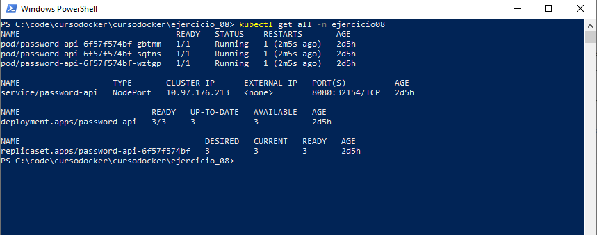

# cursodocker
Taller de Docker y Kubernetes
Ejercicio 08

## Ejercicio

>Escribir los descriptores yaml (deployment y service) para correr la aplicación PasswordAPI(https://hub.docker.com/repository/docker/nicopaez/password-api) en Kubernetes (minikube) con 3 replicas.
>Una vez completo compartir el link al repositorio con los correspondientes descriptores y las instrucción para desplegarlos en minikube y verificar su correcto funcionamiento.

## Comandos

>kubectl create namespace ejercicio08

>kubectl apply -f deployments.yaml -n ejercicio08

>kubectl apply -f service.yaml -n ejercicio08

>kubectl get all -n ejercicio08

>Como estoy ejecutando en windows con el driver de docker, no puedo acceder directamente al service desde mi host, por lo que voy a entrar en un pod y acceder con Curl desde ahi

>kubectl exec -it -n ejercicio08 pod/password-api-6f57f574bf-gbtmm /bin/bash

>curl password-api:8080

