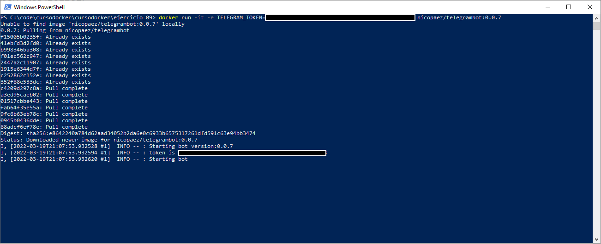
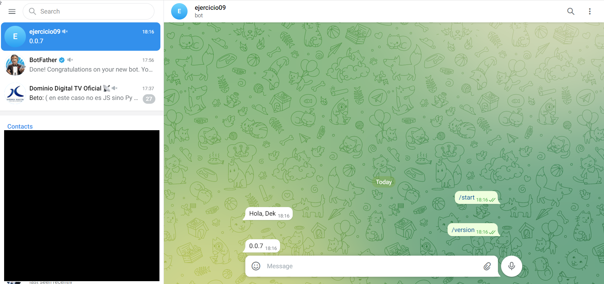
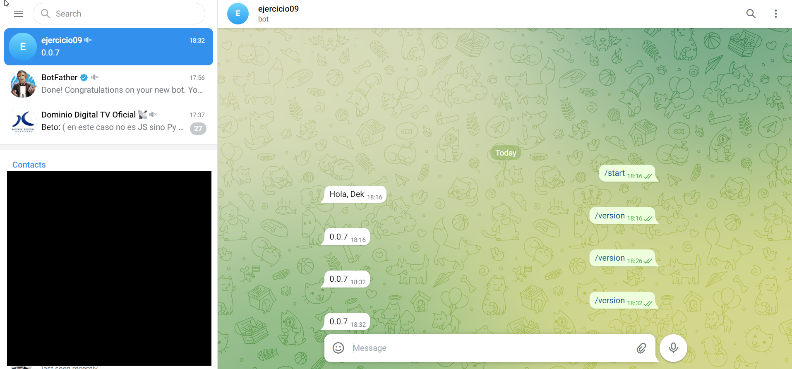

# cursodocker
Taller de Docker y Kubernetes
Ejercicio 09

## Ejercicio

>Desplegar el kubernetes un un bot de telegram.
>
>En primer lugar tiene que crear un bot a partir de:
>
>1) Ir a https://web.telegram.org/#/im?p=@BotFather y seguir los pasos
>2) Enviar el comando /newbot
>3) Seguir los pasos y al final el BotFather responde con un token, tomar nota del token
>
>Luego pueden utilizar esta imagen que ya tiene un bot listo con algunas funcionalidades básicas (nicopaez/telegrambot:0.0.7).
>Para correr esa image necesitas darle una variable de ambiente TELEGRAM_TOKEN con el correspondiente valor del token que tomaron nota >previamente.
>
>Primero pongan a correr el bot localmente con docker run.
>En telegram agreguen el bot como contacto y chateenle "/version". Deberá contestar con la version.
>Una vez que esto corra, entonces escriban los correspondientes descritores para desplegar el bot en minikube.
>
>Finalmente entregar en el github los descriptores (no pongan el valor token, en su lugar pongan A_COMPLETAR)
>En la entrega agregar un screenshot de un chat con el bot que muestre la version.

## Comandos

>kubectl create namespace ejercicio09

>kubectl apply -f deployments.yaml -n ejercicio09

>kubectl set env deployments/telegrambot TELEGRAM_TOKEN=A_COMPLETAR -n ejercicio09

