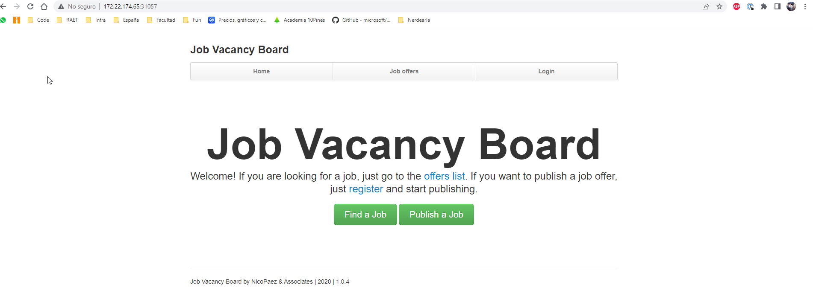

# cursodocker
Taller de Docker y Kubernetes
Ejercicio 11

## Ejercicio

>Escribir todos los descriptores faltantes necesarios para correr en kubernetes la aplicación jobvacancy considerando que:
>
>* El descriptor adjunto
>* La aplicación requiere de 2 variasbles: RACK_ENV: "production" y PORT: "3000"
>* La aplicación espera una variable DATABASE_URL con url de conexión a la base de datos postgres
>
>IMPORTANTE: hay que desplegar un contenedor postgresql (postgres:10.4) no un cluster de postgresql.

## Comandos

>kubectl create namespace ejercicio11

>kubectl apply -f configmap-env.yaml -n ejercicio11

>kubectl apply -f secrets.yaml -n ejercicio11

>kubectl apply -f deployments-db.yaml -n ejercicio11

>kubectl apply -f service-db.yaml -n ejercicio11

>kubectl apply -f deployments-web.yaml -n ejercicio11

>kubectl apply -f service-web.yaml -n ejercicio11

>kubectl get all -n ejercicio11

>minikube ip

